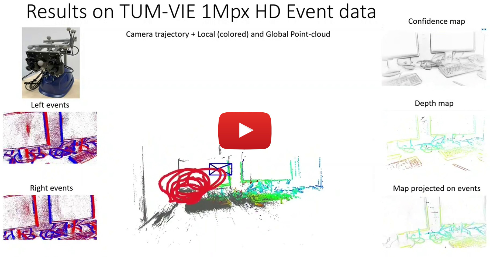

# ES-PTAM: Event-based Stereo Parallel Tracking and Mapping

Official repository for [**ES-PTAM: Event-based Stereo Parallel Tracking and Mapping**](https://arxiv.org/pdf/2408.15605), by [Suman Ghosh](https://www.linkedin.com/in/suman-ghosh-a8762576/), [Valentina Cavinato](https://ch.linkedin.com/in/valentina-cavinato) and [Guillermo Gallego](http://www.guillermogallego.es), published at the **European Conference on Computer Vision (ECCV) Workshops 2024** Milan, Italy.
<h2 align="left">
  
[Paper](https://arxiv.org/pdf/2408.15605) | [Video](https://youtu.be/z7J3lZOYwKs) | [Poster](/docs/esptam_eccvw_2024_poster_v3.pdf)
</h2>

[](https://youtu.be/z7J3lZOYwKs)

:sparkles: It was presented as an **Oral Spotlight** at the [NeVi](https://sites.google.com/view/nevi2024/home-page) Workshop.\
:sparkles: A [live demo](https://x.com/MarcoCristani/status/1841388758299443596/photo/1) was also presented at **ECCV 2024**.

If you use this work in your research, please cite it as follows:

```bibtex
@InProceedings{Ghosh24eccvw,
  author = {Suman Ghosh and Valentina Cavinato and Guillermo Gallego},  
  title = {{ES-PTAM}: Event-based Stereo Parallel Tracking and Mapping},
  booktitle = {European Conference on Computer Vision (ECCV) Workshops},
  year = {2024}
}
```

## Data Processing Pipeline


### Input
* Events from two or more cameras
* Camera calibration (intrinsic, extrinsic) parameters

### Output
* Camera (i.e., sensor rig) poses
* Depth map
* Confidence map
* Point cloud
* Intermediate ray density maps / Disparity Space Images (DSI)

## Code
* [Installation](docs/installation.md)
* [Running examples on different datasets](docs/examples.md)
* [Running live with DAVIS cameras](docs/live_demo.md)
* [Parameter tuning](docs/parameters.md)

## Results
The original ES-PTAM trajectories and GT poses for various sequences are available [here](trajectory_eval).

They have been evaluted using [this tool](https://github.com/uzh-rpg/rpg_trajectory_evaluation/tree/master).

## License

The license is available [here](Software%20License%20Agreement_TUB_ES_PTAM_final.pdf).

Related works
-------
* **[Event-based Stereo Depth Estimation: A Survey](https://arxiv.org/pdf/2409.17680)**
* **[MC-EMVS: Multi-Event-Camera Depth Estimation and Outlier Rejection by Refocused Events Fusion](https://github.com/tub-rip/dvs_mcemvs)**
* [EVO: Event based Visual Odometry](https://github.com/uzh-rpg/rpg_dvs_evo_open/)
   
Additional Resources on Event-based Vision
-------

* [Event Collapse in Contrast Maximization Frameworks](https://github.com/tub-rip/event_collapse)
* [Motion-prior Contrast Maximization (ECCV 2024)](https://github.com/tub-rip/MotionPriorCMax)
* [CMax-SLAM (TRO 2024)](https://github.com/tub-rip/cmax_slam)
* [Research page (TU Berlin, RIP lab)](https://sites.google.com/view/guillermogallego/research/event-based-vision)
* [Course at TU Berlin](https://sites.google.com/view/guillermogallego/teaching/event-based-robot-vision)
* [Event-based Vision: A Survey](http://rpg.ifi.uzh.ch/docs/EventVisionSurvey.pdf)
* [List of Resources](https://github.com/uzh-rpg/event-based_vision_resources)
